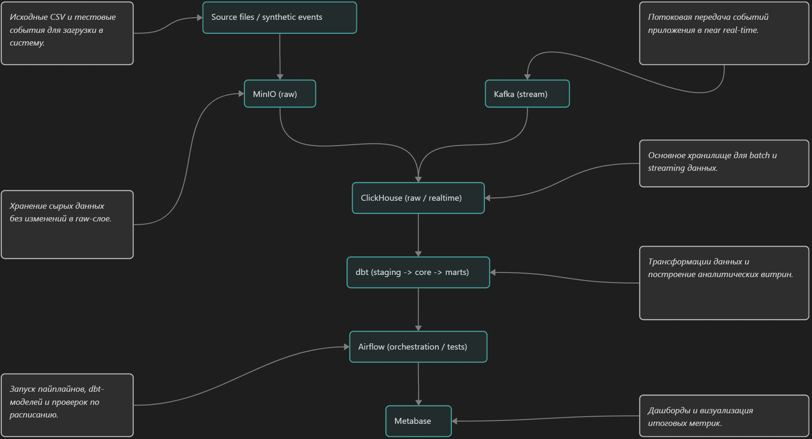

# Mini Data Platform on ClickHouse

Учебный end-to-end проект по data engineering.
Цель: знакомство и освоение инструментов без глубокого погружения в отдельные нюансы.
## О проекте

Проект демонстрирует полный цикл работы с данными:

- загрузка сырых данных в object storage
- хранение и обработка данных в ClickHouse
- трансформации и тесты в dbt
- оркестрация в Airflow
- BI-дашборды в Metabase
- near real-time ingestion через Kafka

## Стек

- [ClickHouse](docker-compose.yml)
- MinIO
- [dbt](dbt_olist/dbt_project.yml)
- [Airflow](infra/airflow/dags/olist_pipeline.py)
- Metabase
- Kafka
- Docker Compose
- PostgreSQL

## Архитектура

## Что реализовано

### Batch-контур
- исходные CSV загружаются в MinIO
- raw-таблицы создаются в ClickHouse
- dbt строит staging, core и marts
- dbt test проверяет качество данных
- Airflow оркестрирует пайплайн

### Stream-контур
- события приложения отправляются в Kafka
- ClickHouse Kafka engine читает topic
- materialized view сохраняет события в MergeTree
- realtime view считает funnel и revenue

## [Дашборды](screens)

### Продажи и выручка
- Daily Revenue
- Daily Orders and Delays

### Качество продавцов
- Top Sellers by Revenue
- Sellers with Most Delays

### Активность клиентов
- Revenue by Customer State
- Top Customers

## [Как запустить проект](start.md)
